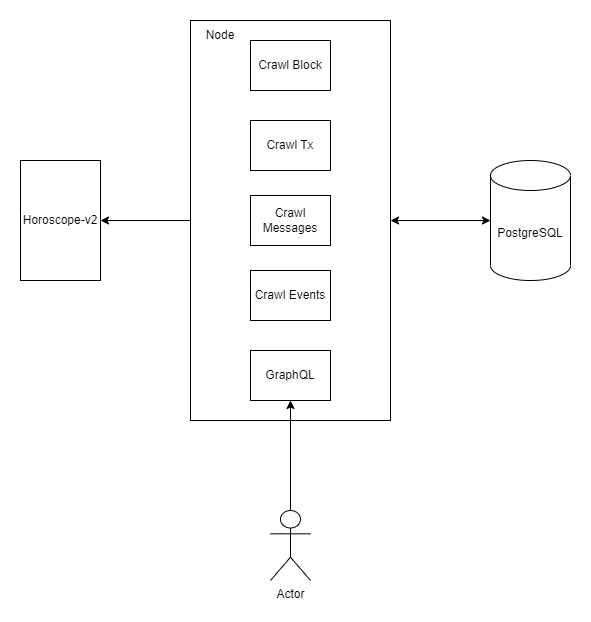

# Track node
Horoscope track node is a node that crawling, stores and manages your data from Horoscope-v2.

Main components:
- Crawler: crawl data from Horoscope-v2 and store into PostgreSQL
- Backend API: provide a backend API(GraphQL)

# Overview Architecture
Node application written by TypeScript.
With crawler, we use Bull to manage the queue of crawling.


# How to run
Requirements:
- NodeJS
- PostgreSQL
- Redis

Start service:
```bash
# Install environment
npm install

# create file env
cp .env.example .env

# run with cli
npm run start:dev
```

# NPM Scripts
- `npm run build`: Build .dist folder to start production mode
- `npm run start`: Start production mode
- `npm run prisma:migrate`: Migrate database with Prisma
- `npm run start:dev`: Run with development mode
- `npm run docker-compose-up`: Run with docker

# Run with docker
Requirements:
- NodeJS
- Docker & Docker compose

Start:

Confirm that DATABASE_URL in .env file matches with docker-compose.env

`npm run docker-compose-up`
